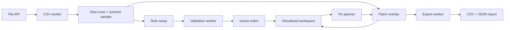

# TableLint — архитектура

## Стек

- React 19 + TypeScript strict + Vite.
- Redux Toolkit для workflow, rules, patches и UI state.
- Web Worker для parsing, validation и export.
- Papa Parse для CSV parser/serializer.
- Zod на границах Worker messages, IndexedDB и JSON report.
- `@tanstack/react-virtual` для строк таблицы.
- `idb` для восстановления сессии.
- CSS Modules + global design tokens; без тяжёлого UI kit.
- Lucide React для интерфейсных иконок.
- Vitest + Testing Library + MSW только при наличии сетевых контрактов; Playwright для happy path.
- ESLint + Prettier + GitHub Actions.

RTK Query не используется: в v1 нет server state. Подключать его «для демонстрации Redux» было бы искусственной сложностью. Сам Redux Toolkit здесь оправдан историей операций, workflow между экранами и derived state.

## Поток данных



Исходные строки считаются неизменяемой базой. Редактирование и fixes записываются как patches. Отображаемое значение вычисляется как base value + последний активный patch. Это делает preview и undo прозрачными и не требует копировать весь dataset на каждую операцию.

## Redux state

```ts
type AppStep = 'upload' | 'rules' | 'workspace' | 'report';

interface RootStateShape {
  session: {
    id: string | null;
    file: FileMeta | null;
    step: AppStep;
    parseStatus: PipelineStatus;
    validationStatus: PipelineStatus;
  };
  schema: {
    columns: ColumnDefinition[];
    rules: ValidationRule[];
  };
  data: {
    rowIds: string[];
    rowsById: Record<string, CsvRow>;
  };
  issues: {
    ids: string[];
    byId: Record<string, ValidationIssue>;
  };
  changes: {
    applied: PatchBatch[];
    undone: PatchBatch[];
    preview: PatchBatch | null;
  };
  workspaceUi: {
    selectedIssueId: string | null;
    filters: IssueFilters;
    leftPanelOpen: boolean;
    inspectorOpen: boolean;
  };
}
```

Для очень больших файлов допустимо перенести полные rows из Redux в repository layer/IndexedDB, оставив в store идентификаторы, метаданные и patches. Это решение принимается только после измерения, а не заранее.

## Worker contract

Каждое сообщение содержит `requestId` и discriminated union `type`. Обе стороны валидируют неизвестный payload через Zod.

- commands: `PARSE_FILE`, `INFER_SCHEMA`, `VALIDATE`, `EXPORT`, `CANCEL`;
- events: `PROGRESS`, `PARSE_COMPLETE`, `VALIDATION_COMPLETE`, `EXPORT_COMPLETE`, `FAILED`.

Поздний ответ старого `requestId` игнорируется. При смене файла текущая операция отменяется.

## Структура проекта

```text
src/
  app/               # store, router, providers, shell
  features/
    upload/
    schema-setup/
    validation/
    workspace/
    fixes/
    export/
    session-recovery/
  entities/
    dataset/
    column/
    issue/
    patch/
  shared/
    ui/
    lib/
    styles/
    workers/
  test/
```

Импорт идёт сверху вниз: `app → features → entities → shared`. Entity и shared не импортируют React-компоненты из features. Не создавать barrel-файлы, если они скрывают циклические зависимости.

## Routes

Один workflow может работать на `/` с состояниями, однако явные URL улучшают восстановление и демонстрацию:

- `/` — upload;
- `/setup` — rule setup, redirect на `/`, если сессии нет;
- `/workspace` — editor, redirect при отсутствии dataset;
- `/report` — export summary, redirect при отсутствии результата.

GitHub Pages требует hash router или корректный SPA fallback. Для простого бесплатного deployment выбирается HashRouter, если используется GitHub Pages; при Cloudflare Pages/Vercel — BrowserRouter с rewrite.

## Безопасность и приватность

- Нет endpoint для файлов и их содержимого.
- Не логировать строки CSV в console или error reporting.
- Формулы, начинающиеся на `=`, `+`, `-`, `@`, при экспорте требуют защиты от CSV injection: режим совместимости с spreadsheet добавляет ведущий apostrophe и отражает это в отчёте.
- Blob URL отзывается после скачивания.
- Имена файлов экранируются и никогда не вставляются через `innerHTML`.

