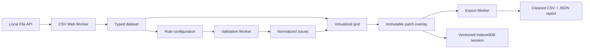

# TableLint

> Локальная проверка, исправление и экспорт CSV перед импортом.


TableLint помогает найти пустые обязательные поля, дубликаты, неверные email, числа, даты и неожиданные значения. Файл обрабатывается в браузере и не отправляется на сервер. Пользователь подтверждает схему, запускает проверку, исправляет данные прямо в таблице и скачивает cleaned CSV вместе с JSON-отчётом.

**Live demo:** после первого запуска workflow `Deploy TableLint` ссылка появится в разделе **Deployments → github-pages** репозитория.

## Зачем этот проект

Обычный табличный редактор позволяет менять ячейки, но не отвечает на вопрос: «готов ли CSV к импорту?». TableLint превращает ручную проверку в воспроизводимый workflow:

1. выбрать реальный CSV или встроенный пример;
2. подтвердить автоматически определённую схему и правила;
3. проверить строки в Dedicated Worker;
4. перейти от проблемы к исходной ячейке;
5. исправить значение inline или применить безопасный batch с preview;
6. отменить/повторить изменения;
7. скачать очищенный CSV и машиночитаемый отчёт.

## Что реализовано

- CSV до 50 МБ, UTF-8/UTF-8 BOM, разделители `,`, `;`, Tab и `|`;
- inference типов `string`, `email`, `number`, `date` с confidence;
- правила required, unique, email, number, date, allowed values, min/max length;
- versioned Worker-контракты с Zod, progress/cancel/retry и stale-response guards;
- виртуализированная таблица для больших наборов данных;
- Excel-like inline edit: Enter/двойной клик, Enter для сохранения, Esc для отмены;
- вкладки «Данные / Проблемы / История» с клавиатурной навигацией;
- immutable patch overlay, preview безопасных исправлений, undo/redo;
- восстановление локальной сессии из IndexedDB;
- экспорт CSV с защитой от spreadsheet injection и JSON-отчёт;
- адаптивные drawers, focus management, live regions и axe-проверки.

## Архитектура



Доменная логика не зависит от React. Исходные строки никогда не мутируются: ручные и автоматические изменения представлены типизированными patch batches. Redux хранит только cross-screen workflow, issues и историю изменений; локальные UI-состояния остаются в компонентах.

## Инженерные решения

| Решение                   | Причина                                                      |
| ------------------------- | ------------------------------------------------------------ |
| Dedicated Workers         | Parsing, validation и export не блокируют основной поток     |
| Zod на границах           | Worker messages, IndexedDB и report не считаются доверенными |
| Base rows + patches       | Preview и undo не требуют копировать весь dataset            |
| `@tanstack/react-virtual` | DOM остаётся ограниченным на больших CSV                     |
| HashRouter                | Статический hosting не требует server-side rewrite           |
| Локальная обработка       | Нет backend, аккаунтов, передачи CSV и расходов на хранение  |

## Производительность и ограничения

Автоматический benchmark проверяет fixture на 100 000 строк и ограниченность DOM. Целевая граница v1 — 50 МБ, но широкие наборы могут занимать в памяти в несколько раз больше исходного файла. Подробности и измерения: [PERFORMANCE.md](PERFORMANCE.md).

TableLint намеренно не поддерживает XLSX, облачное хранение, аккаунты, совместную работу и AI-исправления. Эти функции расширили бы поверхность риска, но не усилили бы основной browser-only сценарий v1.

## Локальный запуск

Требуются Node.js 22 и npm.

```bash
npm install
npm run dev
```

Полная проверка:

```bash
npm run format:check
npm run typecheck
npm run lint
npm test
npm run build
npm run test:e2e
```

При первом локальном E2E-запуске установите Chromium:

```bash
npx playwright install chromium
```

## Публикация

Workflow [deploy.yml](.github/workflows/deploy.yml) собирает статическую версию с правильным base path и публикует её в GitHub Pages. В настройках репозитория выберите **Pages → Source → GitHub Actions**, затем запустите `Deploy TableLint` или отправьте изменения в `master`.

## Стек

React 19, TypeScript strict, Redux Toolkit, Papa Parse, Zod, Web Workers, TanStack Virtual, IndexedDB (`idb`), CSS Modules, Lucide, Vitest, Testing Library, Playwright и axe-core.

## Документация

- [PRODUCT.md](PRODUCT.md) — пользователь, проблема и визуальное направление;
- [TECH_SPEC.md](TECH_SPEC.md) — правила, экраны и Definition of Done;
- [ARCHITECTURE.md](ARCHITECTURE.md) — модули, модели и Worker-контракты;
- [DEVELOPMENT_PLAN.md](DEVELOPMENT_PLAN.md) — этапы производства;
- [PROJECT_STATUS.md](PROJECT_STATUS.md) — проверяемый журнал реализации.
