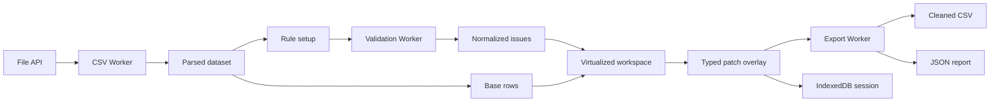

# TableLint

> Private, browser-first CSV validation, cleanup, and export before import.


TableLint finds missing required values, duplicates, malformed email addresses, invalid numbers and dates, and unexpected values. The file is processed entirely in the browser and is never uploaded to a server. Users confirm the inferred schema, run validation, edit values directly in the grid, and download a cleaned CSV with a structured JSON report.

**Live demo:** [https://samequshori.github.io/TableLint/](https://samequshori.github.io/TableLint/)

The interface is available in English and Russian. Language and light/dark theme preferences are stored locally in the browser.

## Why TableLint

A spreadsheet editor lets people change cells, but it does not answer the operational question: “Is this CSV ready to import?” TableLint turns an error-prone manual review into a repeatable workflow:

1. choose a real CSV or the built-in sample;
2. review the inferred schema and validation rules;
3. scan rows in a dedicated Web Worker;
4. navigate from an issue to its source cell;
5. edit a value inline or preview and apply safe batch fixes;
6. undo or redo reversible changes;
7. download the cleaned CSV and a machine-readable report.

## Features

- CSV files up to 50 MB with UTF-8/UTF-8 BOM and `,`, `;`, Tab, or `|` delimiters;
- deterministic inference for `string`, `email`, `number`, and `date` columns;
- required, unique, email, number, date, allowed-values, and min/max-length rules;
- versioned Worker contracts validated with Zod, including progress, cancellation, retry, and stale-response protection;
- a virtualized grid that keeps the DOM bounded for large datasets;
- Excel-style inline editing with Enter/double-click, Enter to save, and Escape to cancel;
- keyboard-accessible Data, Issues, and History tabs;
- immutable patch overlays, safe-fix previews, and bounded undo/redo history;
- local session recovery through IndexedDB;
- CSV export with optional spreadsheet-injection protection and a JSON report;
- persistent English/Russian and light/dark preferences;
- responsive drawers, focus management, live regions, and automated axe checks.

## Architecture



Domain logic is independent from React. Source rows are never mutated: manual edits and automatic fixes are represented as typed patch batches. Redux stores cross-screen workflow state, normalized issues, and change history; local interaction state stays inside components.

## Engineering decisions

| Decision                  | Rationale                                                                |
| ------------------------- | ------------------------------------------------------------------------ |
| Dedicated Web Workers     | Parsing, validation, profiling, and export do not block the main thread  |
| Zod at trust boundaries   | Worker messages, IndexedDB records, and reports are validated before use |
| Base rows plus patches    | Preview and undo do not require copying the full dataset                 |
| `@tanstack/react-virtual` | The rendered DOM remains bounded for large CSV files                     |
| HashRouter                | Static hosting works without server-side SPA rewrites                    |
| Local-only processing     | No backend, accounts, CSV transmission, or storage costs                 |

## Privacy

CSV contents stay on the user’s device. TableLint has no upload endpoint, account system, backend, cloud storage, or data telemetry. Filenames, cell values, and rows are not sent over the network or written to logs.

## Performance and limits

The automated benchmark covers a 100,000-row fixture and asserts a bounded DOM. The v1 product limit is 50 MB, although wide datasets can consume several times their source size in browser memory. Measurements and known constraints are documented in [PERFORMANCE.md](PERFORMANCE.md).

TableLint intentionally does not support XLSX, cloud storage, accounts, collaboration, or AI-based corrections. Those features would enlarge the privacy and reliability surface without strengthening the core browser-only CSV workflow.

## Local development

Requirements: Node.js 22 and npm.

```bash
npm ci
npm run dev
```

Run the complete quality suite:

```bash
npm run format:check
npm run typecheck
npm run lint
npm test
npm run test:e2e
npm run build
```

Install Chromium before the first local end-to-end run:

```bash
npx playwright install chromium
```

## Deployment

The [GitHub Pages workflow](.github/workflows/deploy.yml) builds the static application with the repository base path and publishes the `dist` artifact. In the repository settings, select **Pages → Source → GitHub Actions**, then push to `master` or run **Deploy TableLint** manually.

## Technology

React 19, strict TypeScript, Redux Toolkit, Papa Parse, Zod, Web Workers, TanStack Virtual, IndexedDB (`idb`), CSS Modules, Lucide, Vitest, Testing Library, Playwright, and axe-core.

## Documentation

- [PRODUCT.md](PRODUCT.md) — audience, problem, scope, and visual direction;
- [TECH_SPEC.md](TECH_SPEC.md) — validation rules, screens, and definition of done;
- [ARCHITECTURE.md](ARCHITECTURE.md) — modules, state models, and Worker contracts;
- [DEVELOPMENT_PLAN.md](DEVELOPMENT_PLAN.md) — staged delivery roadmap;
- [PROJECT_STATUS.md](PROJECT_STATUS.md) — implementation evidence and current status.
